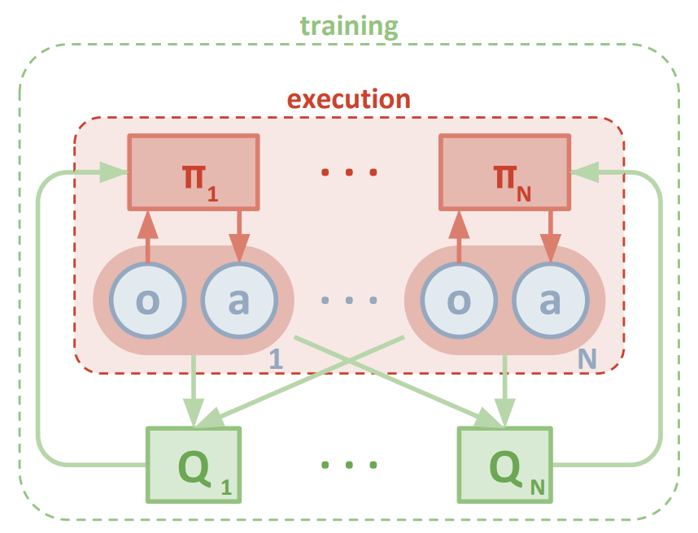

# Report

## Learning Algorithm

Due to the complexitity and requirment of the environmnet (Mutiagent and continous space), I choose a policy-based method, rather than a value based method. 

The algorithm implemented to solve this environment is `Multi-Agent Deep Deterministic Policy Gradient (MADDPG)`, which has outlined by researchers at Google Deepmind in this [paper](https://arxiv.org/pdf/1509.02971.pdf). In this paper, the authors present `"a model-free, off-policy actor-critic algorithm using deep function approximators that can learn policies in high-dimensional, continuous action spaces."`

## Establish Baseline

The baseline model selects actions (uniformly) at random at each time step. The maximum resulted score for baseline model is 0.09, which is ofcourse not following the criteria set by Udacity to solve the agent, also if we watch the agent, we can say the model has not converged yet, however, these type of random action could be useful in the early stage of training process as it helps to explore the action space. This insight will come into play later when we implement the Ornstein-Uhlenbeck process and epsilon noise decay.

 

## The Model

#### Actor-Critic Method

Actor-critic methods leverage the strengths of both policy-based and value-based methods, which contains an actor and a critic network.

A policy-based approach helps the agent (actor) to learns how to act by directly estimating the optimal policy and maximizing reward through gradient ascent whereas a value-based approach helps the 2nd agent (critic) to learns how to estimate the value (i.e., the future cumulative reward) of different state-action pairs. Actor-critic methods combine these two approaches in order to simplify the learning process. Actor-critic agents are also more stable than value-based agents, while requiring fewer training samples than policy-based agents.

In this implementation we have decentralized the actor with centralized critic. The approach  was inspired from the paper by [Lowe and Wu](https://proceedings.neurips.cc/paper/2017/file/68a9750337a418a86fe06c1991a1d64c-Paper.pdf). Whereas traditional actor-critic methods have a separate critic for each agent, this approach utilizes a single critic that receives as input the actions and state observations from all agents. This extra information makes training easier and allows for centralized training with decentralized execution. Each agent still takes actions based on its own unique observations of the environment.

The main key points of the training has highlighted bellow:

* We have used [Ornstein-Uhlenbeck process](https://arxiv.org/pdf/1509.02971.pdf), which by adding certain amount of noise to the action values at each timestep. This noise is correlated to previous noise and therefore tends to stay in the same direction for longer durations without canceling itself out. This allows the agent to maintain velocity and explore the action space with more continuity.
* we have implemented `gradient clipping` using the `torch.nn.utils.clip_grad_norm_ function`.
* we have used `Experience replay`, whcih allows the RL agent to learn from past experience.

#### **state-action spaces**
  
 `Number of agents:`  2

`Size of each action:` 2

There are 2 agents. Each observes a state with length: 24

`The state for the first agent looks like`: [ 0.          0.          0.          0.          0.          0.          0.
  0.          0.          0.          0.          0.          0.          0.
  0.          0.         -6.65278625 -1.5        -0.          0.
  6.83172083  6.         -0.          0.        ]

#### **Hyperparameters**

| Parameter | Description | Value |
| --- | --- | --- |
| `gamma` | Discount factor | 0.99 |
| `tau` | Soft update of target parameters| 7e-2 |
| `lr_actor` | Learning rate for the actor | 1e-3 |
| `lr_critic` | Learning rate for the critic | 1e-3  |
| `weight_deacy` | L2 Weight decay | 0.0000 |
| `epoch decay` | episode to end the noise decay process | 250 |
| `batch_size` | Minibatch size | 128|
| `buffer_size` | Size for memory buffer | int(1e6)|
| `learn_every` | Learning timestep interval | 1 |       
| `learn_num` | Number of learning passes | 1 |
| `end_epoch` | final value for epsilon after decay | 0 |
| `start_epoch`| initial value for epsilon in noise decay process in Agent.act() | 5.0 |
| `ou_sigma` | Ornstein-Uhlenbeck noise parameter, volatility | 0.2 |
| `ou_theta` | Ornstein-Uhlenbeck noise parameter, speed of mean reversion | 0.13 |

## Architecture

The model architecture is a neural network architecture consisting cascaded pairs of linear and non-linear layers.

For both the Actor and Critic, the size of the input linear layer is the state size, and the size of the output linear layer is the number of possible actions.

The output of the Actor is concatenated to the Critic's first layer output to be connected to the first hidden layer's input.

Following is the Neural Network architecture:
 ##### The actor network
 
 
 
 ##### The critic network
 
 

## Result

The agents were trained until an average score of +0.5 was achieved.The best-performing agents were able to solve the environment in 618 episodes, with moving average 0.500 over past 100 episodes. I have run the network for 3500 epochs, best episode was 1378 where `Max Reward: 5.300` and 	`Moving Average: 2.164`
Bellow is the 

 

## Future Improvement

* A grid-search can be used to choose hyperparameter and investigate their influence on the solution.
* Implement Prioritized Experience Replay from the DQN paper to further reduce training time.
* Test other weight initialization methods, to see if training time can be systematically reduced.
* 

## References:
(Lowe et al., 2013), Multi-Agent Actor-Critic for Mixed Cooperative-Competitive Environments

(Silver et al. 2014), Deterministic Policy Gradient

(Lillicrap et al., 2015), Continuous control with deep reinforcement learning

## Acknowledgments
I gratefully acknowledge the Udacity DRLND course.

